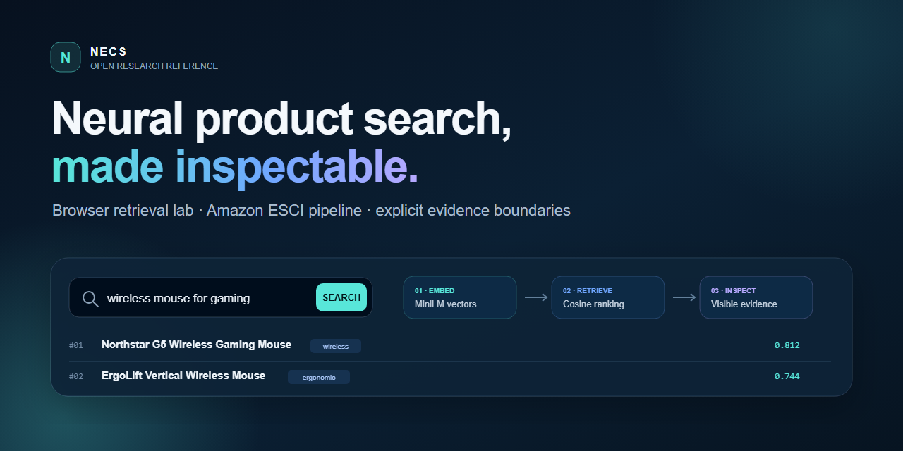

# Neural E-Commerce Search

**A no-backend MiniLM search lab you can fork for any small JSON catalogue in
five minutes, plus an evidence-first Python FAISS + DeBERTa retrieve-and-rank
reference for Amazon ESCI.**

[](https://github.com/Madhvansh/Neural-E-Commerce-Search/actions/workflows/ci.yml)
[](https://github.com/Madhvansh/Neural-E-Commerce-Search/releases)
[](https://www.python.org/)
[](LICENSE)

<p>
  <a href="https://madhvansh.github.io/Neural-E-Commerce-Search/lab.html?q=wireless%20mouse%20for%20gaming"><strong>▶ Try a live query</strong></a>
  &middot;
  <a href="docs/FORK_THE_LAB.md"><strong>Remix your catalogue</strong></a>
  &middot;
  <a href="https://github.com/Madhvansh/Neural-E-Commerce-Search/releases/tag/v0.3.0"><strong>Install v0.3.0</strong></a>
  &middot;
  <a href="https://github.com/Madhvansh/Neural-E-Commerce-Search/issues/new?template=demo_feedback.yml">Report one result</a>
</p>

[](https://madhvansh.github.io/Neural-E-Commerce-Search/lab.html)

<sub>Illustrative project preview. Run the live query above for measured results
from the current browser, model revision, and catalogue.</sub>

## What you can inspect now

- Real client-side MiniLM embeddings and cosine-similarity retrieval.
- A Python retrieve-and-rank architecture with FAISS and DeBERTa components.
- Tested ESCI loaders, hard-negative mining, evaluation, API, and packaging.
- Explicit evidence boundaries instead of unrepeatable benchmark claims.
- A reusable `necs-validate` CLI and GitHub Action for TREC run integrity.

> The live lab uses a general-purpose MiniLM encoder over a 20-product synthetic
> catalogue. ESCI-trained project weights and corrected benchmark bundles are
> not yet published. See [EVIDENCE.md](EVIDENCE.md) for the precise boundary.

If the lab is useful, **[star the repository](https://github.com/Madhvansh/Neural-E-Commerce-Search)**
to save it and follow the reproducibility work, or
**[remix it with your own catalogue](docs/FORK_THE_LAB.md)** in about five minutes.

### Independent verification sprint

No pull request is required for these bounded checks:

- [report one desktop or mobile browser run](https://github.com/Madhvansh/Neural-E-Commerce-Search/issues/5);
- [publish one small catalogue remix](https://github.com/Madhvansh/Neural-E-Commerce-Search/issues/6); or
- [verify the release wheel in a clean Python environment](https://github.com/Madhvansh/Neural-E-Commerce-Search/issues/7).

Each task asks for reproducible environment details and turns confirmed failures
into tracked fixes.

## Try neural retrieval without installing anything

The [NECS Browser Lab](https://madhvansh.github.io/Neural-E-Commerce-Search/lab.html)
loads a quantized all-MiniLM-L6-v2 encoder at pinned revision `751bff3` through
Transformers.js 3.8.1 and ranks a small synthetic product catalogue on the
visitor's device:

- real neural embeddings and cosine-similarity retrieval;
- no account, server-side query logging, or Python environment;
- visible scores, catalogue metadata, and model identity; and
- an explicit boundary between this general-purpose retriever and the
  unreleased ESCI-trained two-stage system.

The first visit downloads roughly 25 MB of quantized model assets plus the
Transformers.js library from Hugging Face and jsDelivr, then caches them. There
is no project query backend. The lab is a runnable neural retrieval
demonstration, not benchmark evidence for the ESCI pipeline.

## Run the offline contract demo in 60 seconds

The bundled demo needs only Python. It uses a tiny synthetic catalogue and
transparent heuristics, so it works offline without downloading data or models:

```bash
python -m pip install "https://github.com/Madhvansh/Neural-E-Commerce-Search/releases/download/v0.3.0/neural_ecommerce_search_madhvansh-0.3.0-py3-none-any.whl"
necs-demo --query "wireless gaming mouse" --top-k 6
```

Or run it directly from a source checkout:

```bash
python scripts/offline_demo.py --query "wireless gaming mouse" --top-k 6
```

```text
Rank  ID     ESCI             Product
----  -----  ---------------  ----------------------------------------------
1     p101   E (Exact)        Orbit V2 Wireless Gaming Mouse
2     p100   E (Exact)        Northstar G5 Wireless Gaming Mouse
3     p102   S (Substitute)   ErgoLine Wired Office Mouse
4     p103   C (Complement)   Extended Gaming Mouse Pad
5     p105   C (Complement)   Replacement USB Receiver for Wireless Mouse
6     p104   I (Irrelevant)   USB-C Laptop Charger 65W
```

This demo validates the CLI and result shape only. It is **not** the neural
pipeline and produces no benchmark evidence. Use `--json` for machine-readable
output or `--catalog path/to/catalog.json` with the documented sample schema.

## Validate retrieval evidence in CI

The v0.3.0 release also ships a standalone TREC-style structural preflight. It
fails on malformed values and duplicate query/document pairs, reports query
coverage, advisory-rank, and unjudged-document diagnostics, and checks optional
task headers before a metric script can silently produce a misleading aggregate.

```bash
necs-validate \
  --qrels examples/validation/sample.qrels \
  --run examples/validation/sample.run \
  --expected-task task1_ranking
```

Use it directly from another repository's workflow:

```yaml
- uses: Madhvansh/Neural-E-Commerce-Search@v0.3.0
  with:
    qrels: evaluation/qrels.txt
    run: evaluation/run.txt
```

See [the validator guide](docs/validation.md) for formats, JSON output, strictness
flags, and the exact evidence boundary. Public downstream uses and caught
failures are welcome through the [validator compatibility report](https://github.com/Madhvansh/Neural-E-Commerce-Search/issues/new?template=validator_report.yml).

## What the full system implements

```text
query -> bi-encoder -> FAISS candidates -> DeBERTa cross-encoder -> ranked ESCI labels
         retrieval                         reranking + classification
```

- A shared bi-encoder with mean or CLS pooling and InfoNCE training.
- Two-pass retriever training with mined hard negatives.
- A four-class ESCI reranker: Exact, Substitute, Complement, Irrelevant.
- BM25 and dense first-stage interfaces for controlled comparisons.
- NDCG, recall, MRR, per-class metrics, and confusion-matrix utilities.
- YAML configuration, deterministic seeding, FastAPI serving, Docker, and CI.

The architecture and module boundaries are described in
[docs/architecture.md](docs/architecture.md).

## Project status and limitations

What is verified in this repository today:

- Lightweight unit tests exercise preprocessing, configuration, metrics,
  hard-negative selection, pipeline orchestration, and the offline demo.
- CI runs the lightweight suite and Ruff on Python 3.9 and 3.11.
- The browser lab runs genuine client-side MiniLM embeddings over synthetic
  catalogue text and exposes the model and similarity scores.
- The demo is deterministic, synthetic, model-free, and safe to run offline.
- The source is MIT licensed and carries contribution and security guidance.

What is not yet verified publicly:

- End-to-end training from a clean environment.
- The historical learned-model metrics shown below.
- Multi-seed uncertainty, model/checkpoint hashes, or raw prediction files.
- Full-catalog candidate generation at production scale.
- Published ESCI-trained model weights, a hosted full two-stage demo, or
  production readiness.

Green CI therefore means the lightweight code paths pass; it does not certify
training, model quality, operational performance, or suitability for a real
commerce system.

## Historical metrics withdrawn pending a corrected rerun

Earlier versions of this repository displayed NDCG, recall, and micro-F1 values
from an undocumented local run. Those values are withdrawn rather than promoted:
the current artifacts do not establish their dataset revision, candidate
generation, model state, raw predictions, or multi-seed protocol.

The corrected evaluation must also keep the official Amazon ESCI tasks separate:
Task 1 ranking uses the reduced ranking subset, while Task 2 multiclass
classification uses the larger labelled set. Ranking and classification metrics
will return only after the evaluator is regression-tested and a complete result
bundle can regenerate every published table.

The evidence requirements and result-bundle contract are documented in:

- [EVIDENCE.md](EVIDENCE.md)
- [docs/reproducibility.md](docs/reproducibility.md)
- [docs/experiments.md](docs/experiments.md)
- [results/README.md](results/README.md)

## Full research quickstart

The commands below require network access, the Amazon ESCI data, the full model
dependencies, and suitable compute. They are separate from the offline demo.

```bash
git clone https://github.com/Madhvansh/Neural-E-Commerce-Search.git
cd Neural-E-Commerce-Search

python -m venv .venv
source .venv/bin/activate                 # Windows: .venv\Scripts\activate
python -m pip install -e ".[all,dev]"

python scripts/download_esci.py --locale us --out data/raw
bash scripts/train_retriever.sh
bash scripts/train_reranker.sh
python scripts/build_index.py
python scripts/run_eval.py --config configs/pipeline.yaml
```

Serve trained artifacts:

```bash
uvicorn necs.api.app:app --host 0.0.0.0 --port 8000
```

Then query `POST /search` through `http://localhost:8000/docs` or curl:

```bash
curl -s localhost:8000/search \
  -H 'content-type: application/json' \
  -d '{"query":"wireless gaming mouse","top_k":5}'
```

## Installation profiles

The project is not currently advertised as a published PyPI package. From a
checkout, install only what you need:

```bash
python -m pip install -e .                 # config, metrics, offline demo
python -m pip install -e ".[retrieval]"   # FAISS + BM25
python -m pip install -e ".[models,data]" # training and ESCI loading
python -m pip install -e ".[serve]"       # API
python -m pip install -e ".[all,dev]"     # full contributor environment
```

The distribution name is `neural-ecommerce-search-madhvansh`; the Python import
package remains `necs`. The old distribution name `necs` is already occupied by
another project. PyPI's JSON endpoint returned `Not Found` for the candidate on
2026-07-19, but that check does not reserve it. Recheck immediately before any
upload and follow [docs/releasing.md](docs/releasing.md).

## Repository map

```text
src/necs/
|-- data/          ESCI loading, preprocessing, and hard negatives
|-- models/        bi-encoder, cross-encoder, and pooling
|-- retrieval/     FAISS dense index and BM25 baseline
|-- training/      retriever and reranker training
|-- eval/          ranking and classification metrics
|-- pipeline/      two-stage orchestration
|-- api/           FastAPI application and schemas
`-- demo.py        dependency-free synthetic output demo
configs/           versionable experiment configuration
scripts/           data, training, evaluation, index, and demo entry points
tests/             lightweight test suite; model-heavy paths may skip
docs/              architecture, data, training, evidence, and deployment
results/           schema and instructions for future result bundles
```

## Documentation

| Document | Purpose |
|---|---|
| [Architecture](docs/architecture.md) | Two-stage design and module map |
| [Data](docs/data.md) | ESCI provenance, fields, labels, and preprocessing |
| [Training](docs/training.md) | Training workflow and configuration |
| [Experiments](docs/experiments.md) | Current evidence status and rerun plan |
| [Reproducibility](docs/reproducibility.md) | Publication checklist and bundle contract |
| [Deployment](docs/deployment.md) | API, Docker, and operational caveats |
| [Browser lab](https://madhvansh.github.io/Neural-E-Commerce-Search/lab.html) | No-login client-side neural retrieval |
| [Run validator](docs/validation.md) | Reusable CLI and GitHub Action for TREC evaluation integrity |
| [Compatibility evidence](docs/compatibility/neural-search-v030.md) | Pinned upstream-fixture trial with machine-readable output |
| [Releasing](docs/releasing.md) | Package-name and release safety checks |
| [Roadmap](ROADMAP.md) | Evidence-first milestones |

## Contributing

Substantive bug fixes, reproductions, documentation corrections, small demo
improvements, and benchmark tooling are welcome. Start with
[CONTRIBUTING.md](CONTRIBUTING.md). For sensitive reports, follow
[SECURITY.md](SECURITY.md) instead of opening a public issue. Support scope and
reporting routes are summarized in [SUPPORT.md](SUPPORT.md).

Local verification:

```bash
ruff check src tests scripts
pytest
```

## Citation

Software citation metadata is available in [CITATION.cff](CITATION.cff). The
dataset paper is:

```bibtex
@article{reddy2022shopping,
  title   = {Shopping Queries Dataset: A Large-Scale ESCI Benchmark for
             Improving Product Search},
  author  = {Reddy, Chandan K. and others},
  journal = {arXiv preprint arXiv:2206.06588},
  year    = {2022}
}
```

## License

MIT. See [LICENSE](LICENSE).
